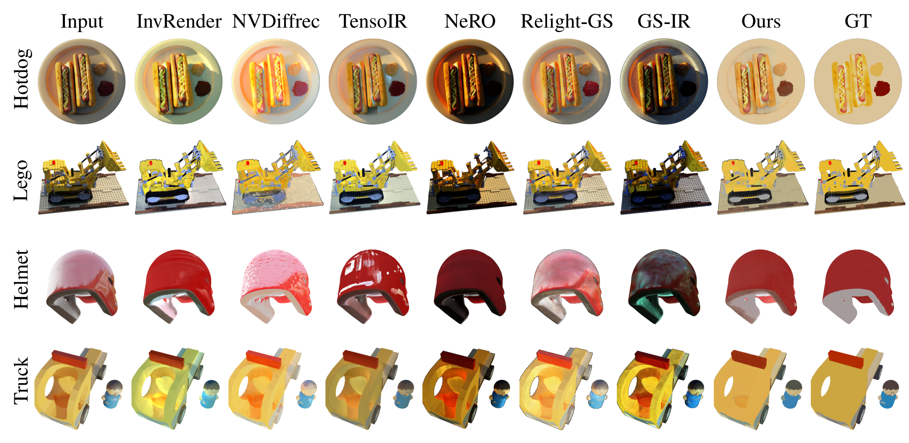
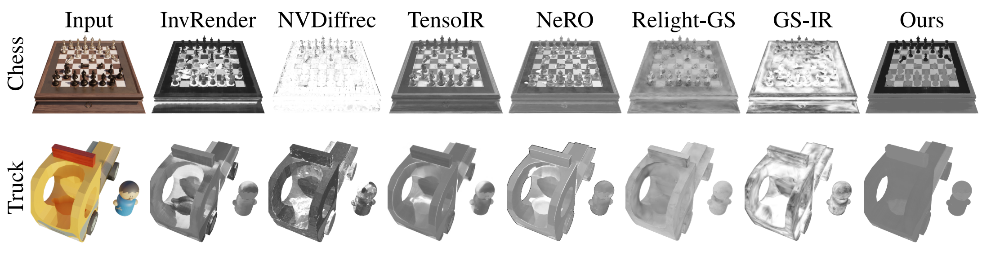
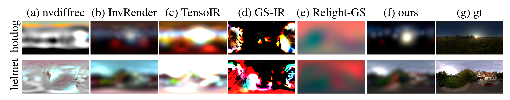
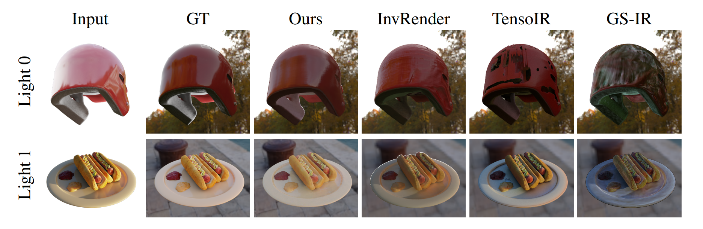
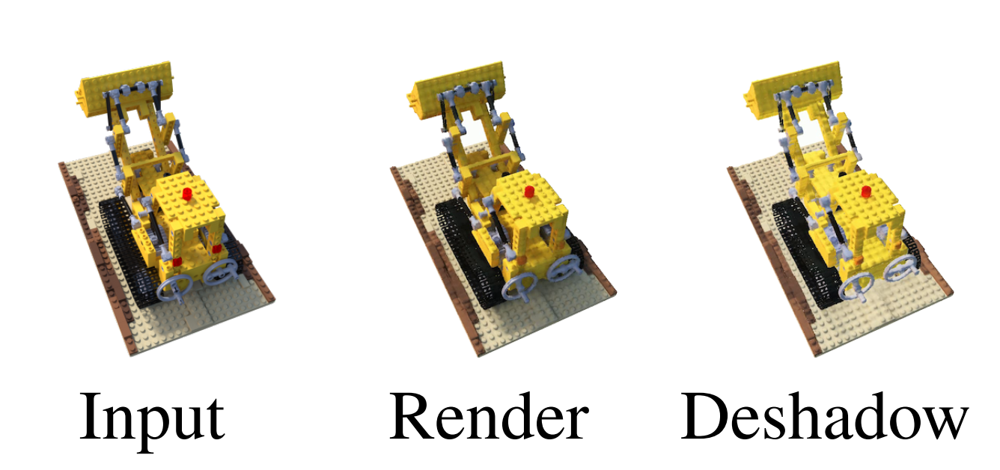

# RobIR: Robust Inverse Rendering for High-Illumination Scenes

## [Project page](https://ingra14m.github.io/RobIR_website) | [Paper](https://arxiv.org/abs/2310.13030) | [Data](https://drive.google.com/drive/folders/1maQVCc7xTxv9NYmWxLFT3bu0M9J4XhK0?usp=sharing)


## News

- **[10/03/2024]** Project page has been released.
- **[9/26/2024]** RobIR (formerly known as SIRe-IR) has been accepted by NeurIPS 2024. We will release the code these days.


## Dataset

In our paper, we use:

- synthetic dataset from [NeRF](https://drive.google.com/drive/folders/128yBriW1IG_3NJ5Rp7APSTZsJqdJdfc1) and our [RobIR dataset](https://drive.google.com/drive/folders/1maQVCc7xTxv9NYmWxLFT3bu0M9J4XhK0?usp=sharing).
- real-world dataset from [NeuS](https://www.dropbox.com/sh/w0y8bbdmxzik3uk/AAAaZffBiJevxQzRskoOYcyja?dl=0).

We organize the datasets as follows:

```
├── data
│   | nerf 
│     ├── hotdog
│     ├── lego 
│     ├── ...
│   | robir_dataset
│     ├── truck
│     ├── chessboard
│     ├── ...
│   | neus
│     ├── bear
│     ├── sculpture
│     ├── ...
```

## Run

### Environment

- Set up the Python environment

```shell
git clone https://github.com/ingra14m/RobIR
cd RobIR

conda create -n robust-ir-env python=3.7
conda activate robust-ir-env

pip install torch==1.13.1+cu116 torchvision==0.14.1+cu116 --extra-index-url https://download.pytorch.org/whl/cu116
pip install pyg-lib torch-scatter torch-sparse torch-cluster torch-spline-conv torch-geometric -f https://data.pyg.org/whl/torch-1.13.0+cu116.html
pip install -r requirements.txt
```


### Stage 1: NeuS (Geometry Prior)

```shell
cd neus
python exp_runner.py --gin_file config/blender.gin
```


### Stage 2: BRDF Estimation

**2.1 Train Norm**

```shell
PYTHONPATH=. python training/exp_runner.py --conf confs_sg/hotdog.conf --data_split_dir data/hotdog --expname hotdog --trainstage Norm
```

**2.2 Train Visibility and Indirect Illumination**

```shell
PYTHONPATH=. python training/exp_runner.py --conf confs_sg/hotdog.conf --data_split_dir data/hotdog --expname hotdog --trainstage Vis
```

**2.3 Train PBR**

```shell
PYTHONPATH=. python training/exp_runner.py --conf confs_sg/hotdog.conf --data_split_dir data/hotdog --expname hotdog --trainstage PBR
```

**2.4 Train Reg-Estim**

```shell
python training/exp_runner.py 
          --conf confs_sg/hotdog.conf
          --data_split_dir data/hotdog
          --expname hotdog
          --trainstage CESR
```


## Results

### Albedo



### Roughness



### Envmap



### Relighting



### De-shadow



## Acknowledgments

This work was supported by Key R\&D Program of Zhejiang (No.2024C01069). We thank Wenxin Sun for her help in pipeline illustration. We also thank Yuan Liu and Wen Zhou for the constructive suggestions. 

## BibTex

```
@article{yang2023sireir,
    title={SIRe-IR: Inverse Rendering for BRDF Reconstruction with Shadow and Illumination Removal in High-Illuminance Scenes},
    author={Yang, Ziyi and Chen, Yanzhen and Gao, Xinyu and Yuan, Yazhen and Wu, Yu and Zhou, Xiaowei and Jin, Xiaogang},
    journal={arXiv preprint arXiv:2310.13030},
    year={2023}
}
```
