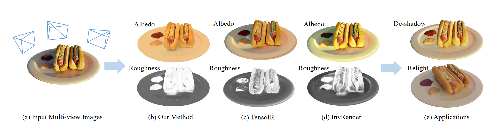
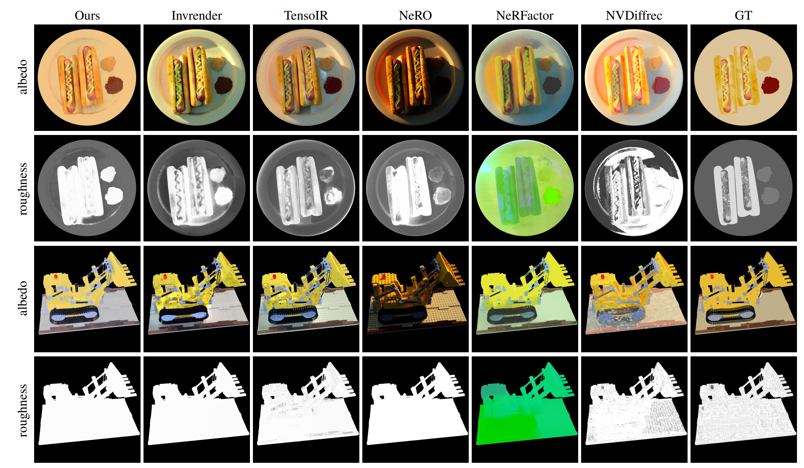

# SIRe-IR: Inverse Rendering for BRDF Reconstruction with Shadow and Illumination Removal in High-Illuminance Scenes

## [Project page (Coming Soon...)](https://ingra14m.github.io/Deformable-3D-Gaussians.github.io/) | [Paper](https://arxiv.org/abs/2310.13030) | [Synthetic Data](https://drive.google.com/drive/folders/1maQVCc7xTxv9NYmWxLFT3bu0M9J4XhK0?usp=sharing) | [Real Data](https://www.dropbox.com/sh/w0y8bbdmxzik3uk/AAAaZffBiJevxQzRskoOYcyja?dl=0)



This repository contains the official implementation associated with the paper "SIRe-IR: Inverse Rendering for BRDF Reconstruction with Shadow and Illumination Removal in High-Illuminance Scenes". We will release our code after we sort it out.


## Preparation

- Set up the Python environment

```shell
conda create -n sire-env python=3.7
conda activate sire-env

pip3 install torch torchvision torchaudio --extra-index-url https://download.pytorch.org/whl/cu116
pip install pyg-lib torch-scatter torch-sparse torch-cluster torch-spline-conv torch-geometric -f https://data.pyg.org/whl/torch-1.13.0+cu116.html
pip install -r requirement.txt
```


## Results




## BibTex

```
@article{yang2023sireir,
    title={SIRe-IR: Inverse Rendering for BRDF Reconstruction with Shadow and Illumination Removal in High-Illuminance Scenes},
    author={Yang, Ziyi and Chen, Yanzhen and Gao, Xinyu and Yuan, Yazhen and Wu, Yu and Zhou, Xiaowei and Jin, Xiaogang},
    journal={arXiv preprint arXiv:2310.13030},
    year={2023}
}
```
